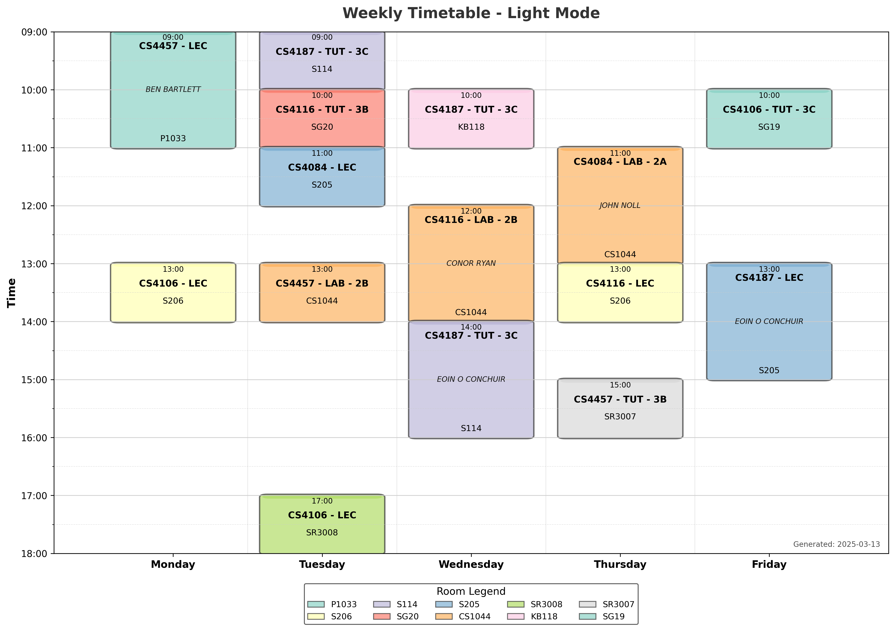
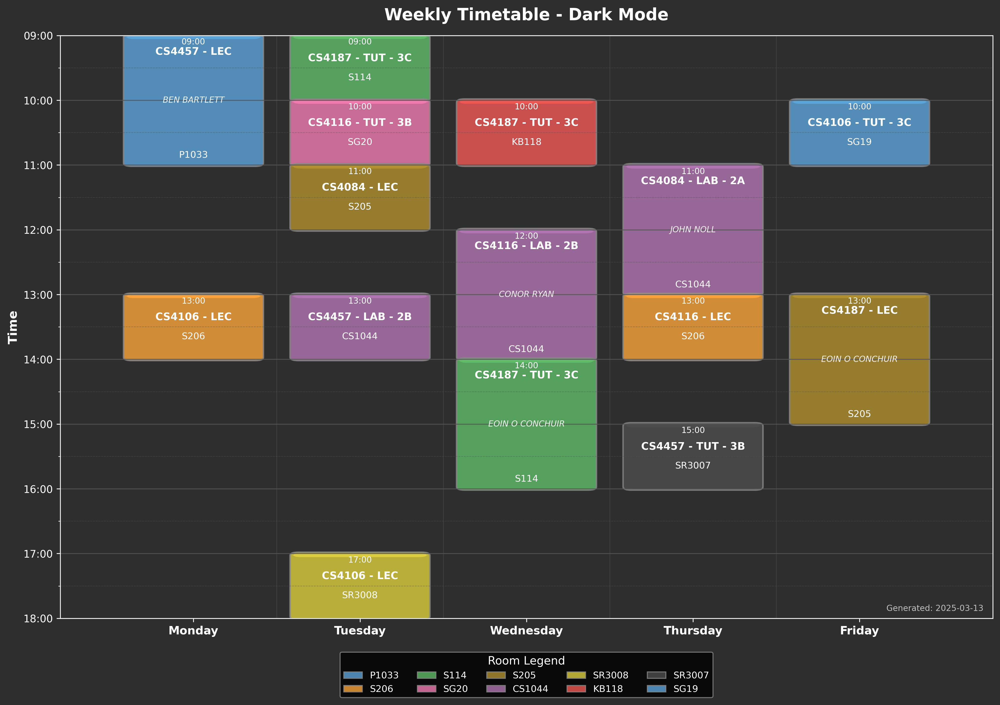
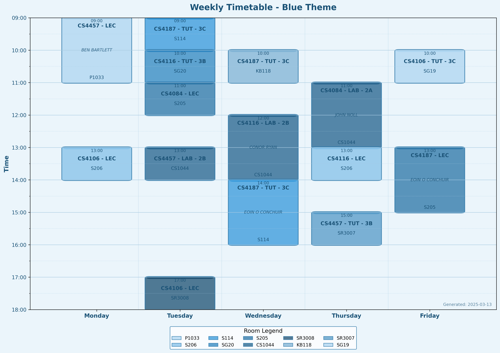
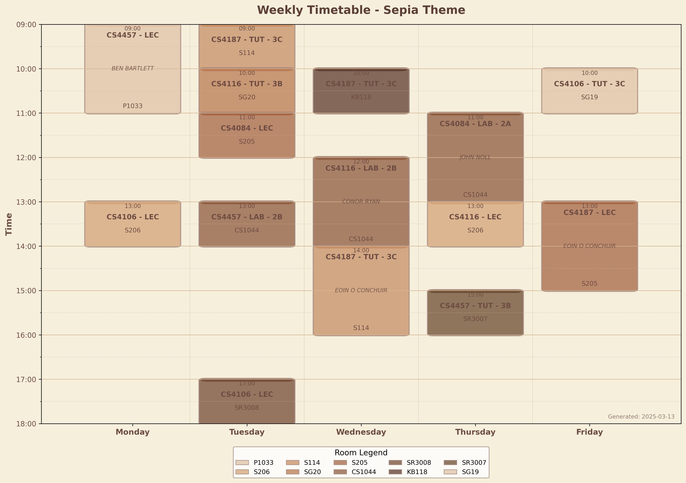
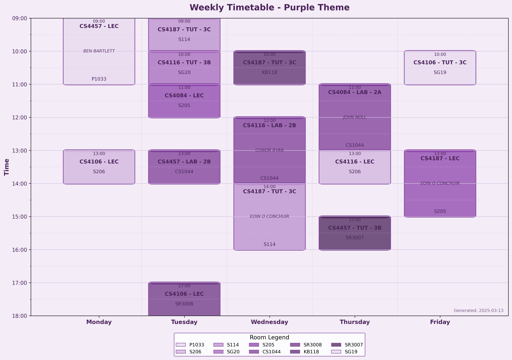
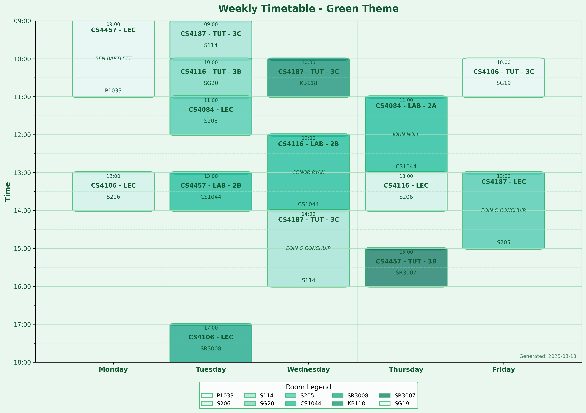
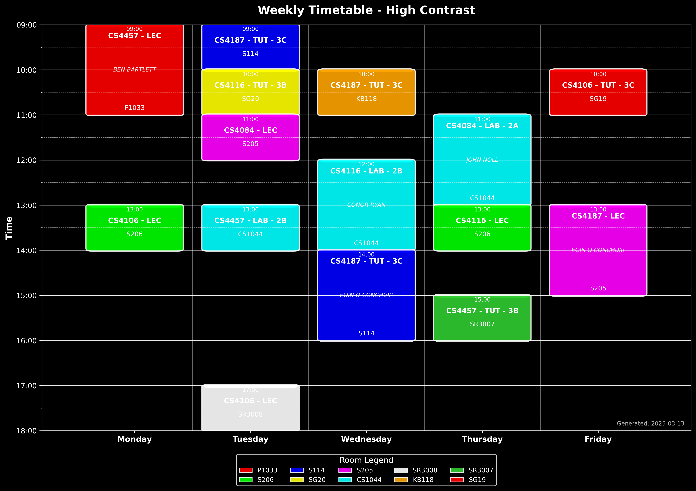

# UL Timetable Scraper

A command-line tool to fetch and display University of Limerick timetables with beautiful visualizations and calendar integration.

## Features

- Scrapes timetable data from the UL timetable website
- Display timetable in JSON or tabular format
- Save timetable to a JSON file
- Generate beautiful visual timetable as PNG images with multiple themes
- Export timetable to calendar format (iCalendar .ics)
- Options to import to Google Calendar and Outlook
- Credentials management:
  - Interactive command line input
  - Command line parameters
  - Environment variables
  - JSON file input
- Robust page loading with intelligent waiting
- Detailed logging with screenshot capabilities

## Installation

### Prerequisites

- Python 3.9 or higher
- [uv](https://github.com/astral-sh/uv) - A faster, more reliable Python package installer and resolver

### Installation Steps

1. Clone this repository:

```bash
git clone https://github.com/yourusername/ul-timetable-scraper.git
cd ul-timetable-scraper
```

2. Create a virtual environment and install the package using uv:

```bash
uv venv
uv sync
```

3. Install Playwright browser dependencies:

```bash
python -m playwright install chromium
```

## Usage

### Basic usage:
```bash
uv run ul-timetable -u "user_id@studentmail.ul.ie" -p "password" -f table 
```

### Some more examples:

```bash
# Run with interactive prompts for credentials
ul-timetable

# Provide credentials via command line
ul-timetable -u "your.email@studentmail.ul.ie" -p "yourpassword"

# Display timetable in tabular format
ul-timetable -f table

# Save timetable to a JSON file
ul-timetable -o timetable.json

# Load credentials from a JSON file
ul-timetable --creds-file credentials.json

# Generate visual timetable images
ul-timetable --image timetable.png

# Generate all theme variations
ul-timetable --image timetable.png --theme all

# Generate specific theme
ul-timetable --image timetable.png --theme blue
ul-timetable --image timetable.png --theme sepia
ul-timetable --image timetable.png --theme contrast

# Export timetable to calendar format
ul-timetable --export-calendar timetable.ics --semester-start 2025-01-20

# Run with browser visible (not headless)
ul-timetable --no-headless

# Enable screenshot capture during scraping
ul-timetable --screenshots

# Get verbose logging
ul-timetable -v
```

### Command-line options:

```
-u, --username       Your UL student email
-p, --password       Your UL password
--creds-file         Path to a JSON file containing credentials
-o, --output         Save timetable to a JSON file
-f, --format         Output format: json or table (default: json)
--image              Generate and save timetable visualization as PNG images
--theme              Theme for visualization: light, dark, blue, sepia, purple, green, contrast, or all (default: light)
--export-calendar    Export timetable to iCalendar (.ics) format
--semester-start     Semester start date in YYYY-MM-DD format (Monday of week 1)
--no-headless        Run browser in visible mode (not headless)
--slow-mo            Slow motion delay in milliseconds (default: 100)
--screenshots        Enable taking screenshots before and after each action
-v, --verbose        Increase logging verbosity
```

## Visual Timetable

The tool can generate beautiful visual representations of your timetable as PNG images in multiple themes:

```bash
# Generate timetable images in all available themes
ul-timetable --image timetable.png --theme all
```

This creates clear, visually appealing, color-coded visualizations of your schedule with the following features:

- Each day of the week is displayed along the X-axis
- Times run vertically along the Y-axis (focused on 9:00-18:00 range)
- Events are color-coded by room with a visually pleasing color palette
- Course codes, lecturer names, room numbers, and time labels are clearly displayed
- Adaptive layout that shows more details for longer events
- Grid lines make it easy to identify class times
- Beautiful rounded corners on event boxes with subtle shadows
- Multiple theme options for different preferences:
  - Light Mode - Clean, professional appearance ideal for printing
  - Dark Mode - Reduced eye strain for nighttime viewing
  - Blue Theme - Calming blue tones
  - Sepia Theme - Warm, paper-like appearance for comfortable reading
  - Purple Theme - Elegant purple shades for a unique look
  - Green Theme - Fresh, nature-inspired green colors
  - High Contrast - Maximum readability for accessibility needs
- Higher resolution output (300 DPI) for better clarity

### Example Visualizations

#### Light Theme


#### Dark Theme


#### Blue Theme


#### Sepia Theme


#### Purple Theme


#### Green Theme


#### High Contrast Theme


## Output Formats

### JSON Output

The timetable can be displayed and saved in JSON format, which is useful for further processing or integration with other tools:

```json
{
    "Monday": [
        {
            "time": "09:00 - 11:00",
            "course_code": "CS4457 - LEC",
            "lecturer": "BEN BARTLETT",
            "room": "P1033",
            "weeks": "Wks:1-11,13"
        },
        {
            "time": "13:00 - 14:00",
            "course_code": "CS4106 - LEC",
            "lecturer": "MALACHY EATON",
            "room": "S206",
            "weeks": "Wks:1-11,13"
        }
    ]
}
```

### Table Output

The timetable can also be displayed in a tabular format in the terminal for better readability:

```
=== Monday ===
+---------------+--------------+---------------+--------+-------------+
| Time          | Course       | Lecturer      | Room   | Weeks       |
+===============+==============+===============+========+=============+
| 09:00 - 11:00 | CS4457 - LEC | BEN BARTLETT  | P1033  | Wks:1-11,13 |
+---------------+--------------+---------------+--------+-------------+
| 13:00 - 14:00 | CS4106 - LEC | MALACHY EATON | S206   | Wks:1-11,13 |
+---------------+--------------+---------------+--------+-------------+
```

## Calendar Export

You can export your timetable to iCalendar format (.ics) and import it into Google Calendar, Outlook, Apple Calendar, or any other calendar application:

```bash
# Export timetable to iCalendar format
ul-timetable --export-calendar timetable.ics --semester-start 2025-01-20
```

The calendar export feature requires you to specify the semester start date (the Monday of week 1) using the `--semester-start` parameter in YYYY-MM-DD format.

### Importing to Google Calendar

1. Export your timetable to .ics format using the command above
2. Go to [Google Calendar](https://calendar.google.com/)
3. Click the "+" button next to "Other calendars" in the sidebar
4. Select "Import"
5. Upload your .ics file
6. Select the target calendar and click "Import"

### Importing to Outlook/Office 365

1. Export your timetable to .ics format using the command above
2. Open Outlook Calendar
3. Click "File" > "Open & Export" > "Import/Export"
4. Select "Import an iCalendar (.ics) or vCalendar file"
5. Browse to your .ics file and click "Open"
6. Choose whether to add the events to your calendar or create a new calendar

## Credentials Management

The tool offers multiple ways to provide your credentials:

### Interactive Prompt

If no credentials are provided, the tool will prompt for them interactively:

```bash
ul-timetable
```

### Command Line Arguments

```bash
ul-timetable -u "your.email@studentmail.ul.ie" -p "yourpassword"
```

### Environment Variables

```bash
export UL_USERNAME="your.email@studentmail.ul.ie"
export UL_PASSWORD="yourpassword"
ul-timetable
```

### Credentials File (JSON)

Create a JSON file with your credentials:

```json
{
  "username": "your.email@studentmail.ul.ie",
  "password": "yourpassword"
}
```

Then use the file with:

```bash
ul-timetable --creds-file credentials.json
```

## Security Notes

- Your credentials are never stored persistently by the tool
- Password input is masked when entered interactively
- Store your credentials file securely if you use that option
- The tool uses HTTPS for all communications with the timetable website


### Testing

Tests are written using pytest and can be run with:

```bash
# Run tests with uv
uv run pytest

# Run tests with verbose output
uv run pytest -v

# Run a specific test file
uv run pytest -v pytest_test.py
```

The test suite includes:
- Unit tests for the HTML parsing functionality
- Integration tests for the timetable scraping with mock credentials

## Screenshots & Diagnostic Features

The tool can take screenshots before and after each action during the scraping process. This is useful for debugging issues or understanding what's happening during the scraping process:

```bash
# Enable action screenshots
ul-timetable --screenshots
```

Screenshots will be saved in the `screenshots/` directory with timestamps and action names.

## Troubleshooting

If the scraper fails to retrieve data:

1. Enable screenshots to see what's happening at each step:
   ```
   ul-timetable --screenshots
   ```

2. Use the visible browser mode to watch the process:
   ```
   ul-timetable --no-headless
   ```

3. Try increasing the slow motion delay if pages load slowly:
   ```
   ul-timetable --slow-mo 500
   ```

4. Check the screenshots folder for error screenshots:
   ```
   ls screenshots/
   ```

5. Enable verbose logging for more detailed information:
   ```
   ul-timetable -v
   ```

6. Make sure your credentials are correct and try again
